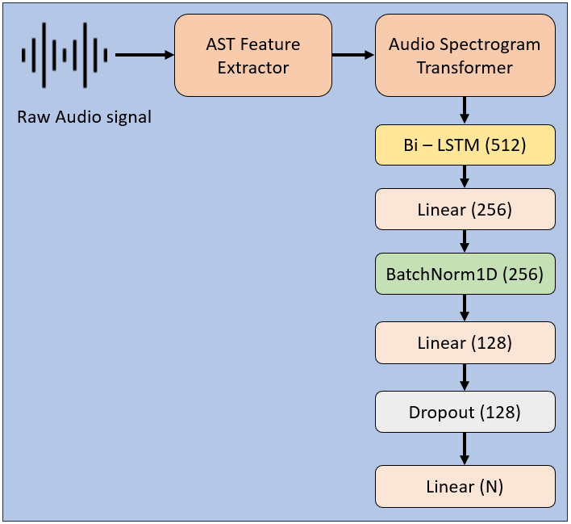

# Environment Sound Classification - Non Convolutional Approach

An Audio classifier built on top on AST that can classify a raw audio waveforms into designated sound categories. Develpeed specifically for Environment and Urban Sound Classification our classifier demonstrated impressive atate-of-the-art results.

## Model Architecture

Our ESC model consists of 2 blocks.

1. AST pre-trained model and its feature extractor module from huggingface trained on Audioset dataset. Kept all the layers frozen except the last few layers to retain the transferred knowledge.

2. Sequential Block consisting of Bi-LSTM, Linear, BatchNorm and Dropout layers. Shaped to process the output from the first block and output the probablity distribution depending on the number of classes.

 

## Features

- **Feature Extraction** : Able to process raw audio waveforms and generate features internally (no need of manual extraction).
- **Variable Input**: Can handle variable length sound events from 0-30 seconds.
- **Flexiblity**: Flexible to the change in number of sound classes at the output (Requires re-training the model).

## Performance 

- **UrbanSound8k:** 
- Accuracy:**99.96%**
    

- **ESC-10:**  
- Accuracy: **99.99%**
    

- **ESC-50:**  
- Accuracy: **99.99%**
    

## Dataset

The model was trained on the **ESC-10, ESC-50, and UrbanSound8K** datasets, which are established benchmark datasets.

## License

This project is licensed under the Apache 2.0 License.
